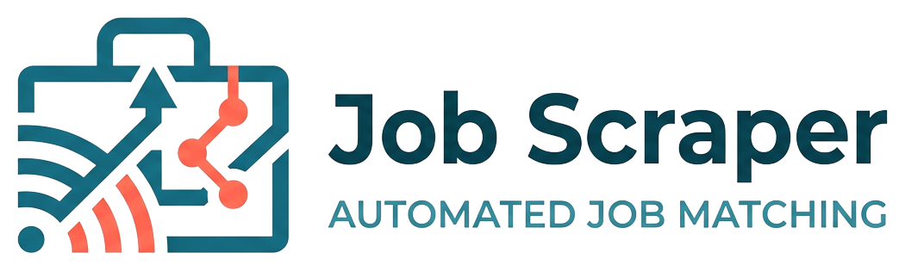
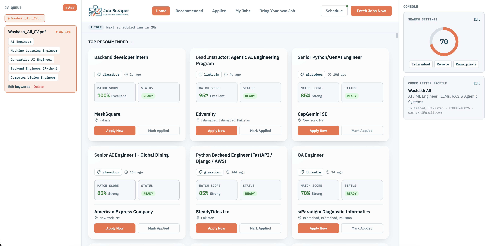
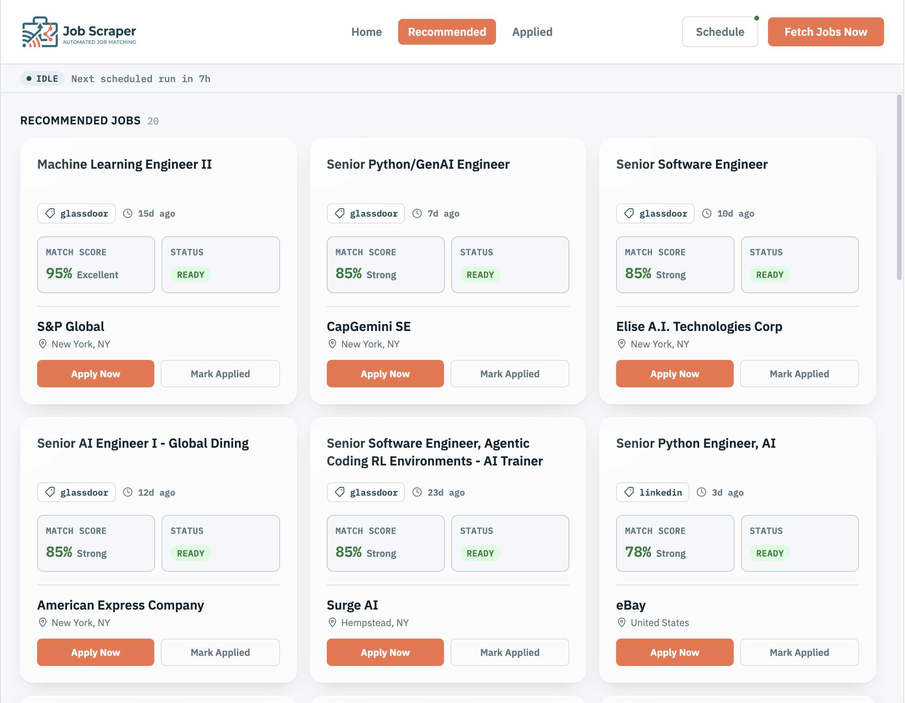
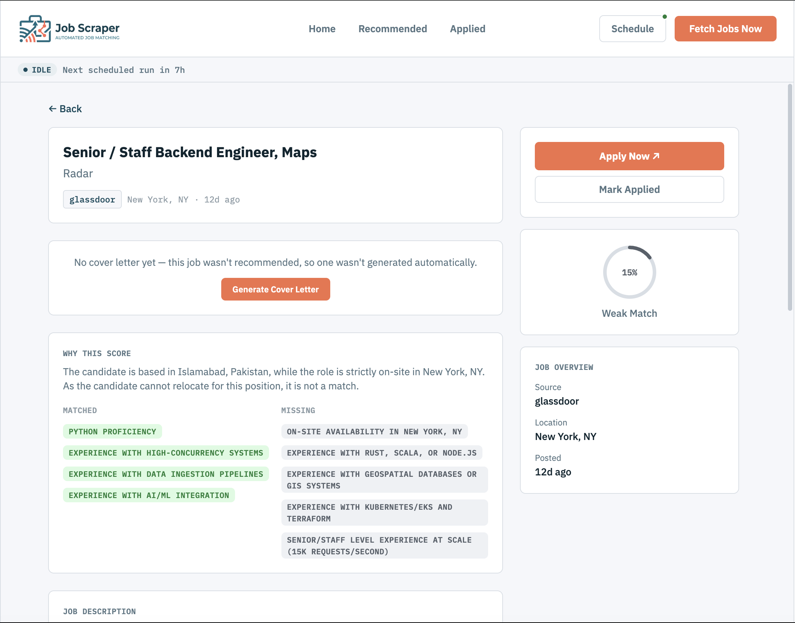
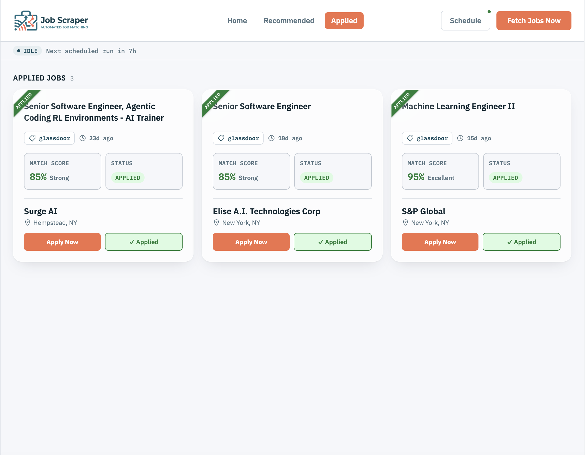
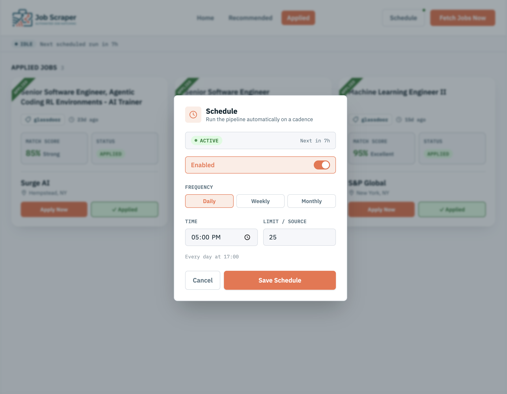

<p align="center">
  
</p>

<p align="center">
  <strong>Stop browsing job boards. Let the pipeline find your next role.</strong>
</p>

<p align="center">
  <a href="#getting-started">Getting Started</a> ·
  <a href="#configuration">Configuration</a> ·
  <a href="#supported-sources">Sources</a> ·
  <a href="#tech-stack">Tech Stack</a>
</p>

---

Job Scraper is a self-hosted job search pipeline: it scrapes listings from multiple job boards on a schedule (or on demand), scores each one against your CV with an LLM, and surfaces only the jobs that are a genuine skills match **and** geographically reachable — on-site/hybrid in a target city, or truly open remote, not remote-but-region-restricted. For anything above your match threshold, it drafts a tailored cover letter automatically, ready to copy or download as a formatted PDF.

No accounts, no SaaS subscription, no third party holding your CV. It runs in one container, on your own machine or server, config lives in `.env`.

## Dashboard

<p align="center">
  
  <br>
  <sub>Home — CV queue, top recommended matches, live run status</sub>
</p>

<table align="center">
  <tr>
    <td width="50%" align="center">
      <br>
      <sub>Recommended jobs, scored and ranked</sub>
    </td>
    <td width="50%" align="center">
      <br>
      <sub>Match rationale, matched vs. missing requirements</sub>
    </td>
  </tr>
  <tr>
    <td width="50%" align="center">
      <br>
      <sub>Tracked applications at a glance</sub>
    </td>
    <td width="50%" align="center">
      <br>
      <sub>Set-and-forget scrape scheduling</sub>
    </td>
  </tr>
</table>

## Features

- **Multi-source scraping** — LinkedIn, Indeed, Glassdoor, RemoteOK, and Remotive, triggered on demand or on a schedule (daily/weekly/monthly, specific time).
- **LLM-scored matches** — every job is scored 0–100 against your CV with an explicit rubric, not keyword matching.
- **Location-aware, not just keyword-aware** — the scorer reads location text carefully: a job labeled "Remote" but restricted to a specific region/country is correctly treated as unreachable, not a match.
- **Automatic cover letters** — jobs above your match threshold get a tailored cover letter generated automatically, plus a formatted PDF with your own letterhead details.
- **One scrape at a time** — manual and scheduled runs share a lock, so nothing doubles up or wastes API budget.
- **Live run status** — see at a glance whether a fetch is running now, when the next scheduled one fires, and what just finished.
- **Multiple CVs** — keep up to a few CVs on hand, switch which one is "active" and driving the pipeline.
- **Runtime-configurable** — target locations, minimum match score, schedule, and CV are all settings you change from the UI, never hardcoded.
- **Bring your own LLM** — Gemini or a local Ollama model, swappable via config.

## Getting Started

The recommended path is Docker — one container, one persistent volume for your database, CVs, and logs.

```bash
git clone <this-repo>
cd job-scrapper
cp .env.example .env   # fill in GEMINI_API_KEY / APIFY_API_TOKEN, etc.
docker compose up -d --build
```

The app is now running at `http://localhost:8888`. Redeploying later (`docker compose up -d --build` again) rebuilds the image but keeps your data — it lives in a named volume, not the container.

### Local development (without Docker)

Backend ([uv](https://docs.astral.sh/uv/)):

```bash
uv sync
uv run python main.py
```

Frontend (separate terminal, proxies `/api` to the backend):

```bash
cd frontend
npm install
npm run dev
```

## Configuration

All configuration lives in `.env` (see `.env.example` for the full list). The essentials:

| Variable | Description |
|---|---|
| `LLM_PROVIDER` | `gemini` or `ollama` |
| `GEMINI_API_KEY` / `GEMINI_MODEL` | Required when using Gemini |
| `GEMINI_RATE_LIMIT_PER_MINUTE` | Paces requests to stay under your quota (default: 14, safely under the free tier's 15/min) |
| `OLLAMA_API_URL` / `OLLAMA_MODEL` | Required when using a local Ollama model instead |
| `APIFY_API_TOKEN` | Powers the LinkedIn/Indeed/Glassdoor scrapers |
| `MIN_SCORE` | Default minimum match score for a job to be "recommended" (changeable later from the UI) |
| `UVICORN_PORT` | Port the app is served on |

Target locations, active CV, minimum score, and the scrape schedule are all set from the app itself once it's running — they're stored in the database, not `.env`.

## Supported Sources

| Source | Method |
|---|---|
| LinkedIn | Apify actor |
| Indeed | Apify actor |
| Glassdoor | Apify actor |
| RemoteOK | Direct API |
| Remotive | Direct API |

## Tech Stack

**Backend:** FastAPI, SQLAlchemy (async) + SQLite, APScheduler, LangChain (Gemini / Ollama), Apify client, fpdf2.
**Frontend:** React, TypeScript, Vite, Tailwind CSS v4.
**Deploy:** Docker, single container serving both API and built frontend.
